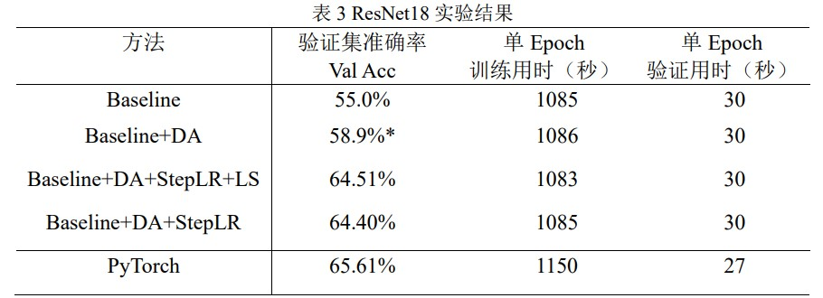
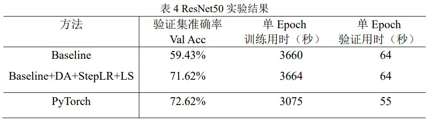

本项目使用C++编写，调用CuDNN，CuBLAS等实现了CUDA环境下ResNet系列网络的复现。

在无测试增强的情况下与PyTorch模型对比精度：

**ResNet18**

**ResNet50**

关于本项目的具体介绍可以查看 `doc.pdf`。

---

This project contains a reproducing of ResNet in CUDA environment with C++/CuDNN/CuBLAS.

If you find this project usefull and can't read `doc.pdf`, u may contact me through zzzc18@outlook.com.
